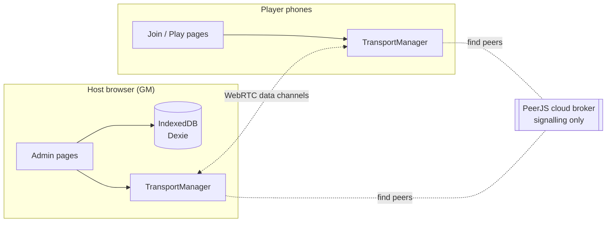
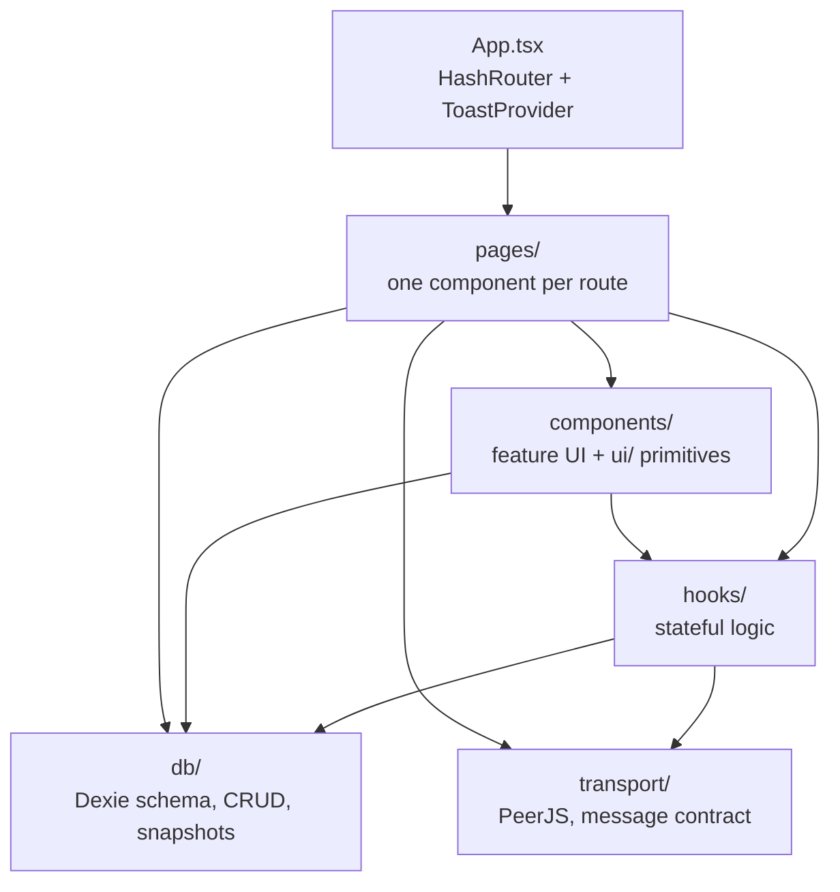
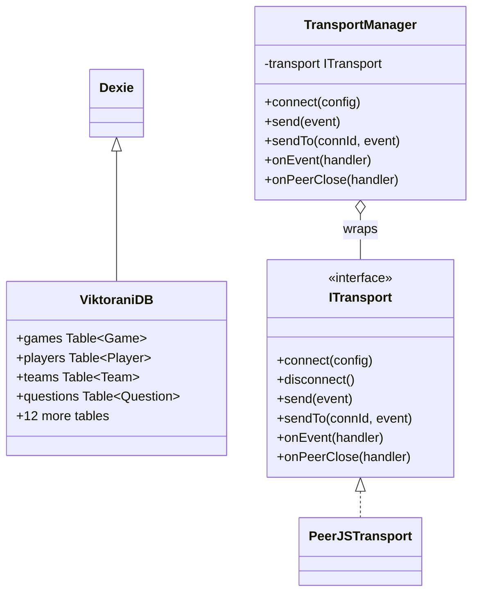
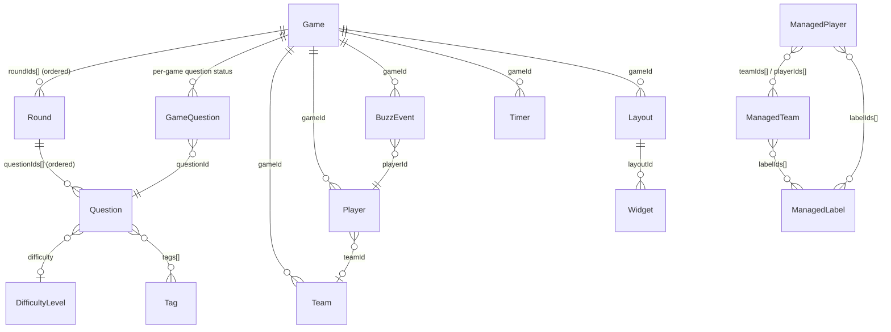
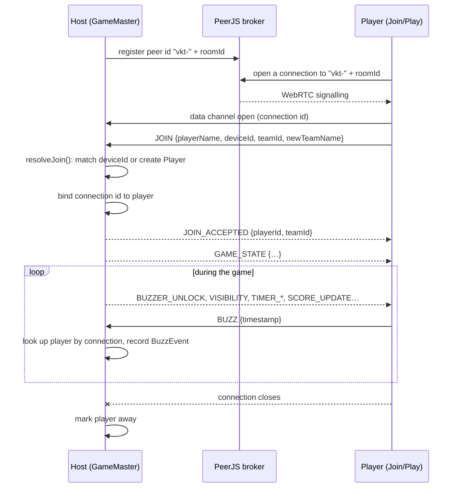
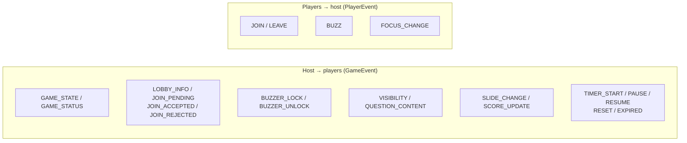
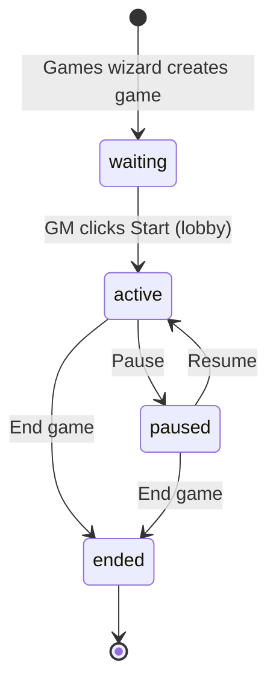
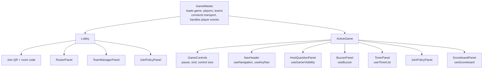
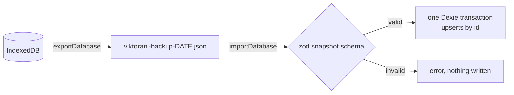

# Architecture

Viktorani is a serverless trivia PWA. The host's browser is the whole backend: it stores
everything in IndexedDB and talks to player phones directly over WebRTC. This guide shows how
the code is organised and how data moves through it. The reasons behind each choice are in the
[ADRs](adr/).

## Contents

- [The big picture](#the-big-picture)
- [Layers](#layers)
- [Source tree](#source-tree)
- [Why there is no class hierarchy](#why-there-is-no-class-hierarchy)
- [Data model](#data-model)
- [Transport](#transport)
- [Game lifecycle](#game-lifecycle)
- [Game master page](#game-master-page)
- [Backups and import](#backups-and-import)
- [Testing](#testing)
- [Known rough edges](#known-rough-edges)

## The big picture



- **No server.** The app is static files on GitHub Pages ([ADR 0001](adr/0001-pwa-no-backend.md)).
- **The host is the source of truth.** Only the GM's browser writes to the database. Players get
  state through transport messages ([ADR 0002](adr/0002-indexeddb-dexie.md)).
- **PeerJS is the only transport.** The public PeerJS broker only introduces peers; game data
  flows directly between browsers ([ADR 0015](adr/0015-peerjs-only-transport.md)).
- **Offline first.** A service worker caches the app shell ([ADR 0010](adr/0010-pwa-offline-first.md)).

## Layers

Each layer only imports from the layers below it.



| Layer         | Responsibility                                                                  |
| ------------- | ------------------------------------------------------------------------------- |
| `pages/`      | Route components. Load data, own page state, compose components.                 |
| `components/` | Feature UI grouped by area (`buzzer/`, `gamemaster/`, `timer/`, …) and `ui/`.    |
| `hooks/`      | Reusable stateful logic: buzzer, timers, navigation, scoreboard, lifecycle.      |
| `db/`         | Dexie database, typed tables, multi-table helpers, backup import/export.         |
| `transport/`  | Real-time messaging between host and players, and the zod message contract.      |
| `types/`      | Shared types that don't belong to a single table (managed players and teams).   |

Reads use `useLiveQuery` (dexie-react-hooks) or a one-off `db.table.get()`. Writes go straight
to `db`, then the writer sends the matching transport event so players stay in sync.

### Routes

The app uses `HashRouter` so it works on GitHub Pages without server rewrites
([ADR 0004](adr/0004-hash-router.md)).

| Route                                   | Page           | Who     |
| --------------------------------------- | -------------- | ------- |
| `/admin`                                | Dashboard      | Host    |
| `/admin/questions`                      | Questions      | Host    |
| `/admin/games`                          | Games (wizard) | Host    |
| `/admin/game/:id`                       | GameMaster     | Host    |
| `/admin/players-teams`                  | PlayersTeams   | Host    |
| `/admin/notes`, `/admin/notes/:id`      | Notes          | Host    |
| `/admin/settings`                       | Settings       | Host    |
| `/admin/layouts/:gameId`                | Layouts (stub) | Host    |
| `/join`, `/join/:roomId`                | Join           | Players |
| `/play/:roomId`                         | Play           | Players |

## Source tree

```text
src/
├── App.tsx, main.tsx        routing, theme, providers
├── pages/
│   ├── admin/               host pages + GameMaster helpers
│   │                        (gamemaster-utils.ts, player-connections.ts)
│   └── player/              Join, Play
├── components/
│   ├── ui/                  Button, Input, Modal, Toast, Icon, control size…
│   ├── gamemaster/          GameControls, RosterPanel, TeamManagerPanel, JoinPolicyPanel
│   ├── host/                HostQuestionPanel and its parts, visibility toggles
│   ├── buzzer/              BuzzerPanel, BuzzList, BuzzerLockButton
│   ├── timer/               TimerPanel, TimerCard, modals, expiry overlay
│   ├── scoreboard/          ScoreboardPanel
│   ├── players-teams/       managed roster: lists, forms, QR, labels
│   └── settings/            difficulties, tags, debug panel
├── hooks/                   useBuzzer, useTimer, useNavigation, useScoreboard, …
├── db/                      index.ts (schema), games.ts, players-teams.ts,
│                            snapshot.ts + snapshot-schema.ts, demo.ts
├── transport/               types.ts, messages.ts, PeerJSTransport.ts, index.ts
└── test/                    Vitest suites (mirrors the tree loosely)
```

## Why there is no class hierarchy

This is a React function-component codebase, so structure comes from **composition**, not
inheritance. Behaviour is shared through hooks and small components, and data shapes are plain
TypeScript interfaces. There are only three classes, each wrapping an external library:



- **`ViktoraniDB extends Dexie`** declares the schema and versions. The singleton is `db`.
- **`PeerJSTransport implements ITransport`** is the only transport. The interface stays so
  tests can use a fake and a future transport can be added without touching callers.
- **`TransportManager`** (singleton `transportManager`) loads PeerJS lazily, validates every
  incoming message and fans events out to subscribers.

The equivalent of "inheritance" elsewhere is:

| Need                     | Pattern used                                                       |
| ------------------------ | ------------------------------------------------------------------ |
| Share stateful behaviour | A custom hook (`useBuzzer`, `useTimer`, `useGameLifecycle`)        |
| Share UI                 | A component with props (`Button`, `Modal`, `HostQuestionPanel`)    |
| Share cross-cutting data | React context (`ToastProvider`, `ControlSizeContext`)             |
| Vary by kind             | Discriminated unions (`TransportEvent`, `Question.type`)           |
| Share pure logic         | Plain functions (`gamemaster-utils.ts`, `db/games.ts`)             |

## Data model

All tables live in one Dexie database, `viktorani`. IDs are UUID strings. Only indexed fields
can be used in `where()`.



- **Question bank:** `questions`, `difficulties`, `tags`, `rounds`. Tags replaced categories
  ([ADR 0011](adr/0011-tag-only-classification.md)).
- **A game:** `games` plus its per-game rows: `gameQuestions`, `teams`, `players`,
  `buzzEvents`, `timers`. Deleting a game removes them all (`db/games.ts`).
- **Managed roster:** `managedPlayers`, `managedTeams`, `managedLabels` are reusable across
  games. A game's `teams`/`players` can be imported from them. The two-way
  `teamIds`/`playerIds` link is kept in sync by `db/players-teams.ts`.
- **Scores:** each `Player.score` and `Team.score` is stored separately; a team's score is not
  the sum of its members.
- **Notes** and **layouts** are standalone (layouts are a stub for now).

### Schema versions

Dexie version numbers only go up ([ADR 0009](adr/0009-dexie-versioned-migrations.md)). To change
the schema, add a `this.version(N + 1)` block under the existing ones in `db/index.ts`, with an
`.upgrade()` to back-fill data if needed. Version 6, for example, back-fills the join policy
fields on existing games.

## Transport

### Connecting



- **Room code** is the only access control. The host's PeerJS id is `vkt-<roomId>`.
- **Identity comes from the connection, not the message.** Player messages carry no `playerId`.
  The host binds each connection to a player on `JOIN` (`PlayerConnections` in
  `pages/admin/player-connections.ts`) and ignores events from unbound connections.
- **Every incoming message is validated.** `transport/messages.ts` holds strict zod schemas with
  size limits; `TransportManager` drops anything that fails `parseTransportEvent()`.
- **`send()`** broadcasts to every player; **`sendTo(connId)`** replies to one.

### Messages



Types are in `transport/types.ts`; schemas and limits are in `transport/messages.ts`. When you
add a message, add both, and a test in `src/test/transport-messages.test.ts`.

The player side (Join and Play connecting and sending events) is being built in Epic #244.

## Game lifecycle



Each transition is written to `games.status` and broadcast as `GAME_STATUS`
(`hooks/useGameLifecycle.ts`). An ended game is read-only. Players and screens follow it:
while paused the buzz button is held, and once ended they keep the final score up instead of
reporting a lost connection.

## Game master page

`pages/admin/GameMaster.tsx` is the busiest part of the app. It renders the **Lobby** while the
game is `waiting` and the **ActiveGame** view otherwise.



- Child panels get the `game` and an `onGameChange(patch)` callback. They write the change to
  the database themselves and pass back only the changed fields; `GameMaster` merges them.
- Player events (`JOIN`, `BUZZ`, `LEAVE`, `FOCUS_CHANGE`) are handled in `GameMaster` and
  forwarded to hooks (for example, buzzes go to `useBuzzer` through `buzzHandlerRef`).
- Control size (S / M / L) is a `ControlSizeContext` provided by `GameMaster` and read by
  `Button` and the larger custom controls.

## Backups and import



A backup holds the question bank (questions, rounds, difficulties, tags), game definitions with
the questions each game plays (`gameQuestions`) and notes; live per-game rows such as players and
buzzes are not included. Import upserts rows by id,
so existing data with other ids is kept, and a failed write rolls back the whole import.
`db/snapshot-schema.ts` accepts older backup versions and fills in defaults for fields added
later, so old backups keep working. Question-only import/export and note files use the same
module. `db/demo.ts` seeds a demo game from the Settings debug panel.

## Testing

- **Vitest** with jsdom and `fake-indexeddb`; each suite starts with `// @vitest-pool vmForks`
  ([ADR 0012](adr/0012-vitest-vmforks-pool.md)). Tests live in `src/test/`.
- `game-flow.test.tsx` renders the real host and player screens, linked by an in-memory
  transport, and plays one buzz from join to score.
- CI runs typecheck, lint, tests with coverage, build and a bundle size check on every PR.

## Known rough edges

- `GameMaster.tsx`, `Games.tsx` and `Questions.tsx` are 750–1150 lines each. Splitting their
  inner components into `components/` would make them easier to follow.
- `gamemaster-utils.ts` and `player-connections.ts` hold domain logic but live under `pages/`.
- Some small UI pieces are duplicated (for example, local `Toggle` switches in the Games wizard,
  the visibility toggles and the join policy panel).
- The player pages are not connected to the host yet (Epic #244).
